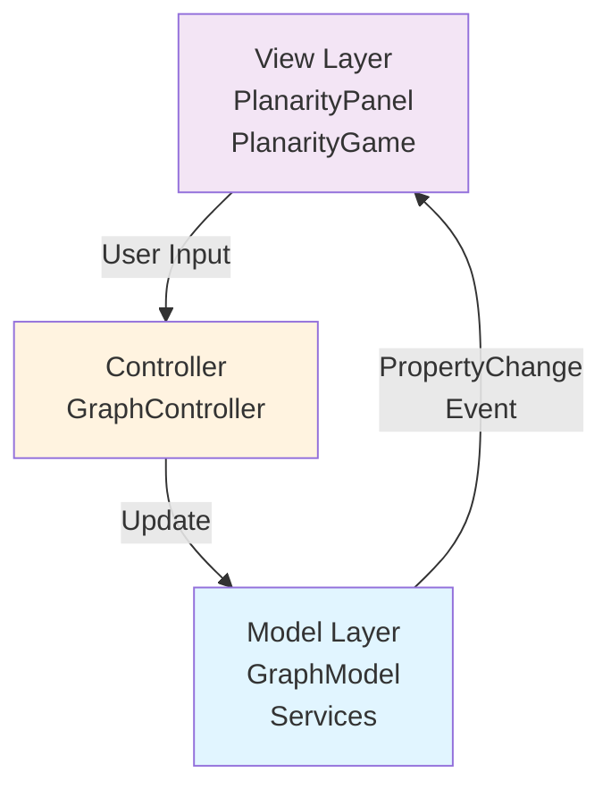

# Planarity Game - Graph Planarity Puzzle 🎮

**Enterprise-Grade Java Graph Theory Library**

[](https://openjdk.org/)
[](LICENSE)
[](https://en.wikipedia.org/wiki/SOLID)

> **[日本語版はこちら / Japanese Version](README.md)**

<p align="center">
  
</p>

## 📖 Overview

**Planarity Game** is a puzzle game where you eliminate edge crossings to create a planar graph layout. This project is a complete enterprise-grade refactoring of legacy code, built on **SOLID principles** and **rigorous graph theory foundations**.

The game provides:
- 🎯 **Intuitive Gameplay**: Drag nodes to eliminate edge intersections
- 🧮 **Theoretical Guarantees**: Always solvable puzzles (based on Kuratowski and Euler theorems)
- 🌏 **Multilingual Support**: Bilingual UI (English/Japanese)
- 🎨 **Polished UI**: Modern graphics with smooth animations

---

## 🎯 Objective

The goal is to **eliminate all edge crossings** to create a planar graph layout.

- 🔴 **Red edges** = Crossing other edges
- 🟢 **Green edges** = No crossings (solved state)
- ⚪ **White circles** = Intersection point markers

<p align="center">
  
</p>

---

## ✨ Key Features

### 🏗️ Architecture Quality

| Principle | Implementation |
|-----------|----------------|
| **Single Responsibility** | Each class has a single responsibility (GraphModel=state, Services=algorithms) |
| **Open/Closed** | Extensible via PropertyChangeListener, closed with immutable objects |
| **Liskov Substitution** | Point/Edge can be used polymorphically |
| **Interface Segregation** | Focused service interfaces |
| **Dependency Inversion** | GraphModel depends on abstractions (IntersectionDetectionService) |

### 📚 Documentation Quality

- ✅ **Complete Javadoc Coverage**: Comprehensive documentation for all public APIs
- ✅ **Complexity Annotations**: `@complexity` annotations on all methods
- ✅ **Theoretical References**: Cites Kuratowski, Wagner, Euler, Boyer-Myrvold theorems
- ✅ **Usage Examples**: Code examples included in documentation

### 🔬 Graph Theory Rigor

**Planarity Guarantees**:
- Edge validation (no self-loops)
- Density constraints: E ≤ 3V - 6 (planar graph property)
- Uses known planar graph structures (Wheel, Cycle)

**Solvability Guarantees**:
- Starts from planar embeddings (circular layout)
- Shuffling preserves graph structure
- Fallback mechanism using guaranteed planar structures

---

## 🚀 Quick Start

### Requirements

- **Java**: 25.0.2 or higher (works with Java 11+)
- **OS**: Windows, macOS, Linux
- **Memory**: Minimum 256MB

### Installation and Running

```bash
# 1. Clone the repository
git clone https://github.com/yourusername/Java-planarity.git
cd Java-planarity

# 2. Compile (UTF-8 encoding required)
javac -encoding UTF-8 io/github/fialuxe/model/*.java \
                       io/github/fialuxe/model/exceptions/*.java \
                       io/github/fialuxe/model/services/*.java \
                       io/github/fialuxe/controller/*.java \
                       io/github/fialuxe/view/*.java

# 3. Run
java io.github.fialuxe.view.PlanarityGame
```

### Clean Build (Recommended)

```bash
# Delete all class files and recompile
find io/github/fialuxe -name "*.class" -delete
javac -encoding UTF-8 io/github/fialuxe/**/*.java
java io.github.fialuxe.view.PlanarityGame
```

> **⚠️ Important**: The `-encoding UTF-8` option is required for Japanese text display!

---

## 🎮 How to Play

### Basic Controls

1. **Drag Nodes**: Click and drag nodes (points) with your mouse
2. **Check Intersections**: Look for red edges and white circles (intersection markers)
3. **Solve the Puzzle**: Arrange nodes until all edges turn green

### Controls

| Action | Description |
|--------|-------------|
| **New Game** | Generate a new graph |
| **Shuffle** | Randomize current graph node positions |
| **Difficulty** | Easy (6 nodes) ~ Super Hard (12 nodes) |
| **How to Play** | Display help dialog |
| **🌐 EN/日本語** | Switch language |

### Tips 💡

- **Start with outer nodes**: Arrange peripheral nodes first for easier solving
- **Use intersection markers**: White circles show where edges cross
- **Look for symmetry**: Many graphs have symmetric optimal solutions

---

## 🏛️ Architecture

### Project Structure

```
Java-planarity/
├── io/github/fialuxe/
│   ├── model/                      # Domain model layer
│   │   ├── Point.java              # Immutable 2D coordinates
│   │   ├── Edge.java               # Immutable edge (with validation)
│   │   ├── GraphModel.java         # Graph state management
│   │   ├── LanguageManager.java    # Internationalization
│   │   ├── exceptions/             # Custom exceptions
│   │   │   ├── GraphException.java
│   │   │   └── InvalidGraphStateException.java
│   │   └── services/               # Business logic
│   │       ├── IntersectionDetectionService.java  # Computational geometry
│   │       ├── PlanarityValidator.java            # Planarity testing
│   │       └── GraphGenerator.java                # Puzzle generation
│   ├── controller/
│   │   └── GraphController.java    # Mouse event handling
│   └── view/
│       ├── PlanarityPanel.java     # Game screen rendering
│       └── PlanarityGame.java      # Main window
├── test/                           # JUnit tests (created)
└── README.md
```

### MVC Design Pattern



### Core Classes

#### `Point.java` - Immutable Value Object
```java
Point p1 = new Point(100, 200);
Point p2 = Point.fromAwtPoint(awtPoint);
double distance = p1.distance(p2);  // Euclidean distance
```

#### `Edge.java` - Graph Edge
```java
Edge edge = new Edge(0, 1);  // Connect nodes 0 and 1
boolean shares = edge.sharesVertex(otherEdge);
```

#### `GraphModel.java` - State Management
```java
GraphModel model = new GraphModel();
model.addPropertyChangeListener(evt -> {
    // Handle graph changes
});
model.addNode(new Point(50, 50));
model.addEdge(0, 1);
boolean solved = model.isGameSolved();
```

---

## 🔬 Theoretical Foundation

### Graph Theory Guarantees

#### Planarity Testing (O(E²))
```java
PlanarityValidator validator = new PlanarityValidator();
boolean isPlanar = validator.isPlanar(nodes, edges);
int crossings = validator.countIntersections(nodes, edges);
```

Internal algorithms:
- **Intersection Detection**: Orientation test using cross product (computational geometry)
- **Theoretical Basis**: Kuratowski's Theorem, Wagner's Theorem
- **Complexity**: O(E²) (quadratic in number of edges)

#### Puzzle Generation Guarantees

```java
GraphGenerator generator = new GraphGenerator(model);
generator.generateRandomGraph(nodeCount, width, height);
```

**Strategy**:
1. **Circular Layout**: Place nodes on circle perimeter (always planar)
2. **Edge Addition**: Respect E ≤ 3V - 6 constraint
3. **Fallback**: Use wheel/cycle graphs for guarantee
4. **Shuffle**: Randomize node positions (create puzzle)

**Mathematical Guarantees**:
- Euler's formula: V - E + F = 2
- Planar graph max edges: E ≤ 3V - 6
- Connectivity guarantee: Initial cycle formation

---

## 🧪 Testing

JUnit 5 test suites created (in `test/` directory):

```bash
# With Maven
mvn test

# Manual execution
javac -encoding UTF-8 -cp junit-jupiter-api-5.x.jar test/**/*.java
java -jar junit-jupiter-engine-5.x.jar --scan-classpath
```

**Test Coverage**:
- ✅ `PointTest.java`: Constructors, distance calculation, equals/hashCode
- ✅ `EdgeTest.java`: Validation, vertex sharing, equality
- ⏳ Other classes (planned)

---

## 📊 Performance

| Operation | Complexity | Description |
|-----------|-----------|-------------|
| Add Node | O(1) | ArrayList amortized |
| Add Edge | O(1) | ArrayList amortized |
| Move Node | O(E²) | Includes intersection detection |
| Detect Intersections | O(E²) | Check all edge pairs |
| Generate Puzzle | O(V² + V·E) | Typical case |

**Optimization Tips**:
- Keep node count ≤ 12 for UI responsiveness
- Consider spatial partitioning for large graphs (future enhancement)

---

## 🌐 Internationalization

### Supported Languages
- 🇬🇧 English
- 🇯🇵 Japanese

### Adding New Languages

Edit `LanguageManager.java`:

```java
static {
    addTranslation("new.key", "English Text", "日本語テキスト");
}
```

---

## 🐛 Troubleshooting

### Issue 1: Japanese Text Not Displaying

**Symptom**: Buttons and labels are blank or garbled

**Solution**:
```bash
# Delete class files and recompile
find io/github/fialuxe -name "*.class" -delete
javac -encoding UTF-8 io/github/fialuxe/**/*.java
```

### Issue 2: Japanese Displays as Boxes (Tofu)

**Symptom**: Japanese characters appear as squares

**Cause**: Font issue (already fixed - using Meiryo font)

**Solution**: Recompile View files
```bash
javac -encoding UTF-8 io/github/fialuxe/view/*.java
```

### Issue 3: Initialization Error

**Symptom**: `IllegalArgumentException: Width and height must be positive`

**Cause**: Graph generation before window layout (already fixed)

---

## 🤝 Contributing

Pull requests are welcome! Please note:

1. **Coding Style**: Include complete Javadoc
2. **SOLID Principles**: Follow existing architectural patterns
3. **Testing**: Add JUnit tests for new features
4. **Complexity**: Include `@complexity` annotations
5. **Theoretical Accuracy**: Maintain graph theory guarantees

---

## 📜 License

MIT License - See [LICENSE](LICENSE) file for details

---

## 🙏 Acknowledgments

### Theoretical Foundation
- **Kuratowski's Theorem** (1930) - Planarity characterization
- **Wagner's Theorem** (1937) - Forbidden K₅ and K₃,₃ minors
- **Euler's Formula** (1750) - V - E + F = 2
- **Boyer-Myrvold Algorithm** - O(V) planarity testing (reference only)

### Inspiration
- Original Planarity game by John Tantalo
- Graph theory community

---

## 📚 References

### Graph Theory
- [Introduction to Graph Theory](https://www.graphtheory.com/) - Douglas B. West
- [Planar Graphs](https://en.wikipedia.org/wiki/Planar_graph) - Wikipedia

### Algorithms
- [Computational Geometry](https://www.cs.princeton.edu/~rs/AlgsDS07/) - Robert Sedgewick
- [Line Segment Intersection](https://en.wikipedia.org/wiki/Line_segment_intersection)

### Design Patterns
- [SOLID Principles](https://en.wikipedia.org/wiki/SOLID) - Robert C. Martin
- [Design Patterns](https://refactoring.guru/design-patterns) - Gang of Four

---

## 📞 Support

- **Issues**: [GitHub Issues](https://github.com/yourusername/Java-planarity/issues)
- **Discussions**: [GitHub Discussions](https://github.com/yourusername/Java-planarity/discussions)

---

<p align="center">
  Made with ❤️ using SOLID principles and graph theory rigor
</p>

<p align="center">
  <sub>Refactored from legacy code to enterprise-grade library (2026)</sub>
</p>
