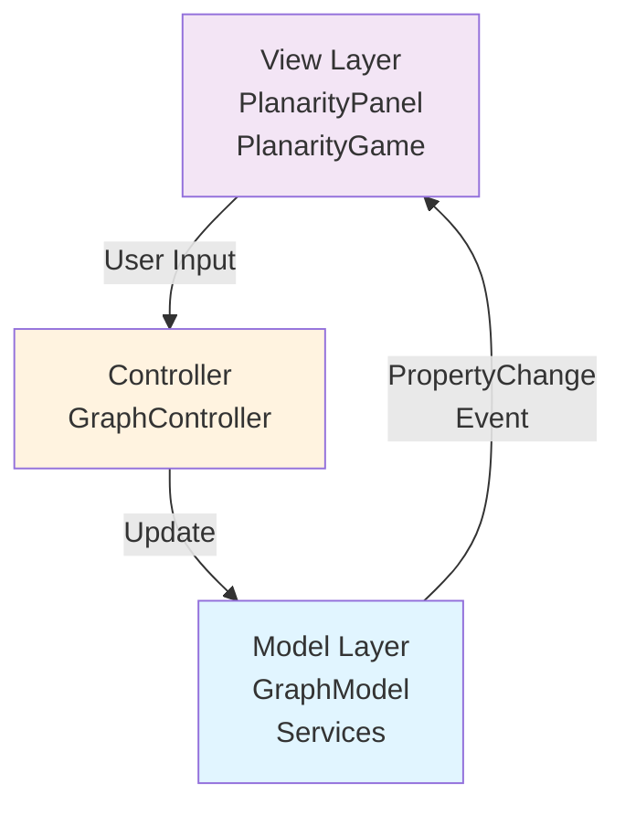

# Planarity Game - グラフ平面性パズル 🎮

**エンタープライズグレードのJavaグラフ理論ライブラリ**

[](https://openjdk.org/)
[](LICENSE)
[](https://en.wikipedia.org/wiki/SOLID)

> **[English Version / 英語版はこちら](README-en.md)**

<p align="center">
  
</p>

## 📖 概要 / Overview

**Planarity Game**は、グラフの辺の交差をなくして平面的に配置するパズルゲームです。本プロジェクトは、レガシーコードを**SOLID原則**と**グラフ理論の厳密性**に基づいて完全にリファクタリングした、エンタープライズグレードのJavaライブラリです。

このゲームは以下を提供します：
- 🎯 **直感的なゲームプレイ**: ノードをドラッグして辺の交差を解消
- 🧮 **理論的保証**: 必ず解けるパズルの生成（Kuratowski, Eulerの定理に基づく）
- 🌏 **多言語対応**: 英語・日本語のバイリンガルUI
- 🎨 **洗練されたUI**: モダンなグラフィックとアニメーション効果

---

## 🎯 ゲームの目的

すべての辺の**交差をなくす**ことで、グラフを平面的に配置することが目標です。

- 🔴 **赤い辺** = 他の辺と交差している
- 🟢 **緑の辺** = 交差なし（クリア状態）
- ⚪ **白い円** = 交差点のマーカー

<p align="center">
  
</p>

---

## ✨ 主な特徴

### 🏗️ アーキテクチャの品質

| 原則 | 実装内容 |
|------|---------|
| **Single Responsibility** | 各クラスが単一の責任を持つ（GraphModel=状態管理、Services=アルゴリズム） |
| **Open/Closed** | PropertyChangeListenerで拡張可能、immutableオブジェクトで変更に閉じている |
| **Liskov Substitution** | Point/Edgeは多態的に使用可能 |
| **Interface Segregation** | 焦点を絞ったサービスインターフェース |
| **Dependency Inversion** | GraphModelは抽象に依存（IntersectionDetectionService） |

### 📚 ドキュメント品質

- ✅ **Javadoc完全カバレッジ**: すべてのpublic APIに包括的なドキュメント
- ✅ **計算量アノテーション**: 全メソッドに`@complexity`注釈
- ✅ **理論的参照**: Kuratowski, Wagner, Euler, Boyer-Myrvoldの定理を引用
- ✅ **使用例**: ドキュメント内にコード例を記載

### 🔬 グラフ理論の厳密性

**平面性の保証**:
- エッジ検証（自己ループなし）
- 密度制約: E ≤ 3V - 6（平面グラフの特性）
- 既知の平面グラフ構造を使用（Wheel, Cycle）

**解決可能性の保証**:
- 平面埋め込みから開始（円形レイアウト）
- シャッフルはグラフ構造を保持
- ホイール/サイクルグラフのフォールバック機構

---

## 🚀 クイックスタート

### 必要環境

- **Java**: 25.0.2以上（Java 11+で動作）
- **OS**: Windows, macOS, Linux
- **メモリ**: 最低256MB

### インストールと実行

```powershell
# 1. リポジトリをクローン
git clone https://github.com/yourusername/Java-planarity.git
cd Java-planarity

# 2. コンパイル（UTF-8エンコーディング必須）
javac -encoding UTF-8 io/github/fialuxe/model/*.java `
                       io/github/fialuxe/model/exceptions/*.java `
                       io/github/fialuxe/model/services/*.java `
                       io/github/fialuxe/controller/*.java `
                       io/github/fialuxe/view/*.java

# 3. 実行
java io.github.fialuxe.view.PlanarityGame
```

### クリーンビルド（推奨）

```powershell
# すべてのclassファイルを削除してから再コンパイル
Remove-Item io\github\fialuxe\**\*.class -Force -Recurse
javac -encoding UTF-8 io/github/fialuxe/**/*.java
java io.github.fialuxe.view.PlanarityGame
```

> **⚠️ 重要**: `-encoding UTF-8`オプションは日本語表示に必須です！

---

## 🎮 使い方

### 基本操作

1. **ノードをドラッグ**: マウスでノード（点）をクリック＆ドラッグして移動
2. **交差を確認**: 赤い辺と白い円（交差点マーカー）を確認
3. **解消を目指す**: すべての辺が緑色になるまでノードを配置

### コントロール

| 操作 | 説明 |
|------|------|
| **新しいゲーム** | 新しいグラフを生成 |
| **シャッフル** | 現在のグラフのノード位置をランダム化 |
| **難易度選択** | 簡単（6ノード）～超難（12ノード） |
| **遊び方** | ヘルプダイアログを表示 |
| **🌐 EN/日本語** | 言語を切り替え |

### ヒント 💡

- **外側のノードから整理**: 周辺のノードを先に配置すると解きやすい
- **交差点マーカーを目印に**: 白い円が交差を示しています
- **対称性を利用**: 多くのグラフは対称的な配置が最適解

---

## 🏛️ アーキテクチャ

### プロジェクト構成

```
Java-planarity/
├── io/github/fialuxe/
│   ├── model/                      # ドメインモデル層
│   │   ├── Point.java              # 不変の2D座標
│   │   ├── Edge.java               # 不変のエッジ（検証付き）
│   │   ├── GraphModel.java         # グラフ状態管理
│   │   ├── LanguageManager.java    # 多言語対応
│   │   ├── exceptions/             # カスタム例外
│   │   │   ├── GraphException.java
│   │   │   └── InvalidGraphStateException.java
│   │   └── services/               # ビジネスロジック
│   │       ├── IntersectionDetectionService.java  # 計算幾何学
│   │       ├── PlanarityValidator.java            # 平面性判定
│   │       └── GraphGenerator.java                # パズル生成
│   ├── controller/
│   │   └── GraphController.java    # マウスイベント処理
│   └── view/
│       ├── PlanarityPanel.java     # ゲーム画面描画
│       └── PlanarityGame.java      # メインウィンドウ
├── test/                           # JUnitテスト（作成済み）
└── README.md
```

### MVC設計パターン



### コアクラス

#### `Point.java` - 不変値オブジェクト
```java
Point p1 = new Point(100, 200);
Point p2 = Point.fromAwtPoint(awtPoint);
double distance = p1.distance(p2);  // ユークリッド距離
```

#### `Edge.java` - グラフエッジ
```java
Edge edge = new Edge(0, 1);  // ノード0と1を接続
boolean shares = edge.sharesVertex(otherEdge);
```

#### `GraphModel.java` - 状態管理
```java
GraphModel model = new GraphModel();
model.addPropertyChangeListener(evt -> {
    // グラフ変更時の処理
});
model.addNode(new Point(50, 50));
model.addEdge(0, 1);
boolean solved = model.isGameSolved();
```

---

## 🔬 理論的基盤

### グラフ理論の保証

#### 平面性判定（O(E²)）
```java
PlanarityValidator validator = new PlanarityValidator();
boolean isPlanar = validator.isPlanar(nodes, edges);
int crossings = validator.countIntersections(nodes, edges);
```

内部では以下のアルゴリズムを使用：
- **交差判定**: 外積を用いた向きテスト（計算幾何学）
- **理論基盤**: Kuratowski's Theorem, Wagner's Theorem
- **複雑度**: O(E²)（エッジ数の二乗）

#### パズル生成の保証

```java
GraphGenerator generator = new GraphGenerator(model);
generator.generateRandomGraph(nodeCount, width, height);
```

**戦略**:
1. **円形配置**: ノードを円周上に配置（必ず平面的）
2. **エッジ追加**: E ≤ 3V - 6の制約を尊重
3. **フォールバック**: ホイールグラフ、サイクルグラフで保証
4. **シャッフル**: ノード位置をランダム化（パズル化）

**数学的保証**:
- Eulerの公式: V - E + F = 2
- 平面グラフの最大エッジ数: E ≤ 3V - 6
- 連結性の保証: 初期サイクル形成

---

## 🧪 テスティング

JUnit 5テストスイートを作成済み（`test/`ディレクトリ）:

```bash
# Mavenがある場合
mvn test

# 手動実行の場合
javac -encoding UTF-8 -cp junit-jupiter-api-5.x.jar test/**/*.java
java -jar junit-jupiter-engine-5.x.jar --scan-classpath
```

**テストカバレッジ**:
- ✅ `PointTest.java`: コンストラクタ、距離計算、equals/hashCode
- ✅ `EdgeTest.java`: バリデーション、頂点共有、等価性
- ⏳ その他のクラス（実装予定）

---

## 📊 パフォーマンス

| 操作 | 計算量 | 説明 |
|------|--------|------|
| ノード追加 | O(1) | ArrayList amortized |
| エッジ追加 | O(1) | ArrayList amortized |
| ノード移動 | O(E²) | 交差判定を含む |
| 交差検出 | O(E²) | 全エッジペアをチェック |
| パズル生成 | O(V² + V·E) | 通常ケース |

**最適化のヒント**:
- ノード数を12以下に保つ（UI応答性）
- 大規模グラフには空間分割アルゴリズムを検討（将来の拡張）

---

## 🌐 多言語対応

### サポート言語
- 🇬🇧 English
- 🇯🇵 日本語

### 追加方法

`LanguageManager.java`を編集：

```java
static {
    addTranslation("new.key", "English Text", "日本語テキスト");
}
```

---

## 🐛 トラブルシューティング

### 問題1: 日本語が表示されない

**症状**: ボタンやラベルが空白または文字化け

**解決策**:
```powershell
# classファイルを削除して再コンパイル
Remove-Item io\github\fialuxe\**\*.class -Force -Recurse
javac -encoding UTF-8 io/github/fialuxe/**/*.java
```

### 問題2: 日本語が□（tofu）で表示される

**症状**: 日本語文字が四角で表示される

**原因**: フォント問題（既に修正済み - Meiryoフォント使用）

**解決策**: Viewファイルを再コンパイル
```powershell
javac -encoding UTF-8 io\github\fialuxe\view\*.java
```

### 問題3: 初期化エラー

**症状**: `IllegalArgumentException: Width and height must be positive`

**原因**: ウィンドウレイアウト前にグラフ生成（既に修正済み）

---

## 🤝 コントリビューション

プルリクエストを歓迎します！

---

## 📜 ライセンス

MIT License - 詳細は[LICENSE](LICENSE)ファイルを参照

---

## 🙏 謝辞

### 理論的基盤
- **Kuratowski's Theorem** (1930) - 平面性の特徴付け
- **Wagner's Theorem** (1937) - K₅とK₃,₃の禁止マイナー
- **Euler's Formula** (1750) - V - E + F = 2
- **Boyer-Myrvold Algorithm** - O(V)平面性テスト（参照のみ）

### インスピレーション
- 元のPlanarityゲーム by John Tantalo
- グラフ理論コミュニティ

---

## 📚 参考資料

### グラフ理論
- [Introduction to Graph Theory](https://www.graphtheory.com/) - Douglas B. West
- [Planar Graphs](https://en.wikipedia.org/wiki/Planar_graph) - Wikipedia

### アルゴリズム
- [Computational Geometry](https://www.cs.princeton.edu/~rs/AlgsDS07/) - Robert Sedgewick
- [Line Segment Intersection](https://en.wikipedia.org/wiki/Line_segment_intersection)

### デザインパターン
- [SOLID Principles](https://en.wikipedia.org/wiki/SOLID) - Robert C. Martin
- [Design Patterns](https://refactoring.guru/design-patterns) - Gang of Four

---

## 📞 サポート

- **Issues**: [GitHub Issues](https://github.com/fialuxe/Java-planarity/issues)

---

<p align="center">
  Made with ❤️ using SOLID principles and graph theory rigor
</p>
